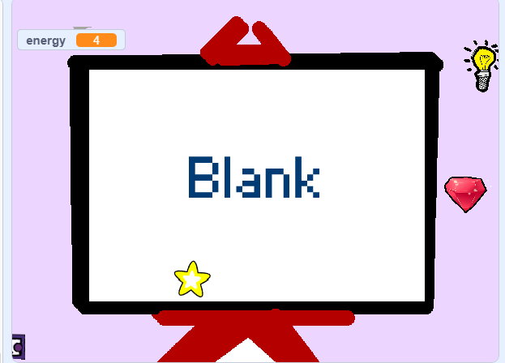
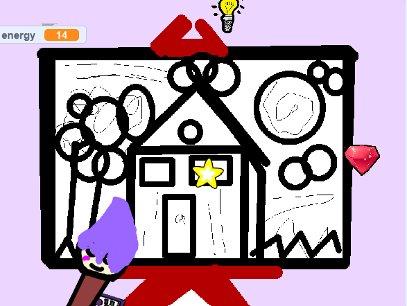
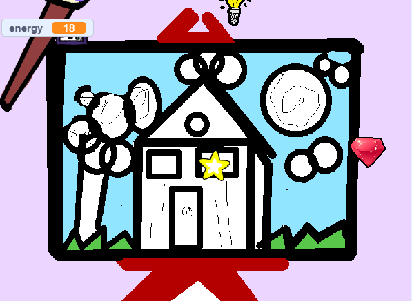
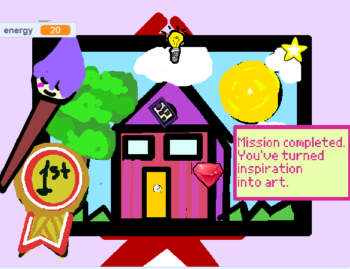

# 🎨 The Artist's Mind 

## Overview

**The Artist's Mind** is an interactive Scratch-based game created for CS50x (Week 0) that explores creativity as a progression system. The player controls a paintbrush and collects inspiration-based objects while avoiding distractions. As energy increases, a blank canvas gradually transforms into a finished artwork, visually representing the creative process from idea to completion.

---

## Motivation

This project was designed to merge my interest in **art and interactive design with computer science**. Rather than building a traditional score-based game, I focused on using code as a storytelling tool. The core idea is that creativity is not instant—it builds over time through focus, iteration, and refinement.

Each element in the game represents this process:
- Inspiration increases progress
- Distractions slow development
- Consistent effort leads to completion

---

## How It Works

- The player starts the game using the **Space key**
- Movement is controlled via the **mouse**
- Collectible objects increase an internal **energy variable**
- A moving obstacle reduces progress
- The game world visually evolves based on energy level
- Reaching the final threshold completes the artwork and triggers a win state

---

## Key Features

- Dynamic energy-based progression system
- Multi-stage visual transformation of a single artwork
- Custom Scratch block with input parameter (`change energy by (amount)`)
- Event-driven architecture using broadcasts (`START`, `RESET`, `WIN`)
- Collision-based interaction system
- Audio and visual feedback for actions
- Original artwork used for final visual design

---

## Technical Concepts

This project applies core programming concepts including:

- Variables and state management
- Conditional logic
- Loops and continuous updates
- Custom abstraction via blocks
- Event-driven programming (broadcast system)
- Collision detection
- Sprite-based animation and state switching

---

## Challenges & Learning

A key challenge was synchronizing gameplay mechanics with visual progression. I learned how to structure logic so that multiple sprites respond consistently to a shared state (energy). Debugging broadcast timing and collision behavior also helped strengthen my understanding of event-driven systems.

This project also introduced the importance of abstraction—using a custom block simplified repeated logic and made the code more scalable and readable.

---

## Future Improvements

If expanded further, I would add:

- Multiple levels with different art styles
- Difficulty scaling (faster obstacles or reduced energy gain)
- Save or high-score system
- Additional collectible types with unique effects
- More advanced animations for transitions between stages

---

 ## Screenshots

### Start Screen

### Sketched Canvas

### In Progress

### Finished Artwork

---

## Tools Used

- Scratch 3.0

---

## Course Context

Developed as part of **CS50x: Introduction to Computer Science (2026)**, Week 0 Scratch project.

---

## Note

All artwork and game logic were created independently for educational purposes.
